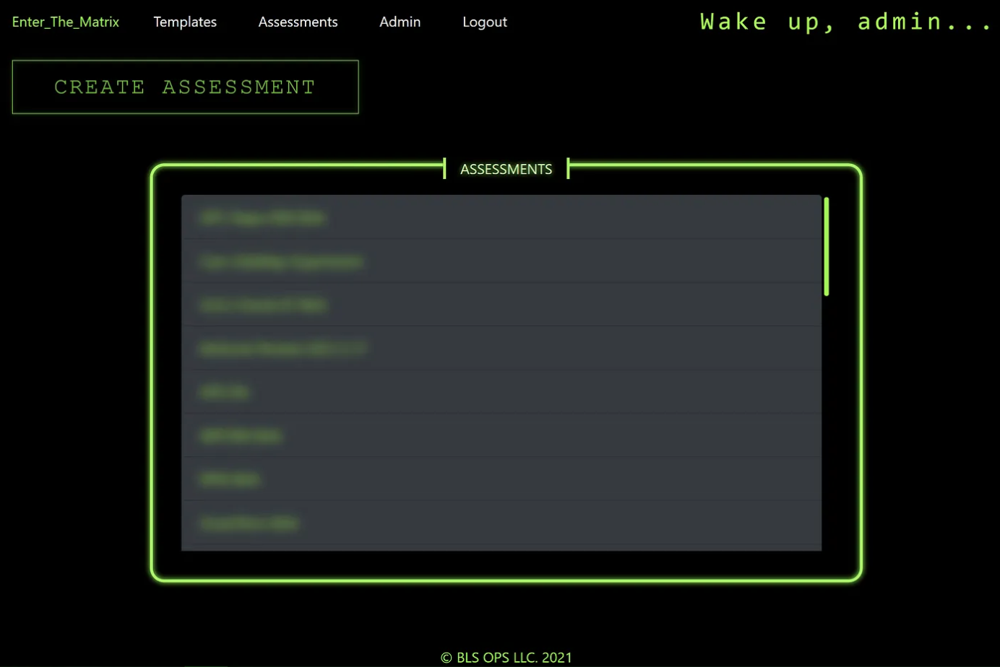
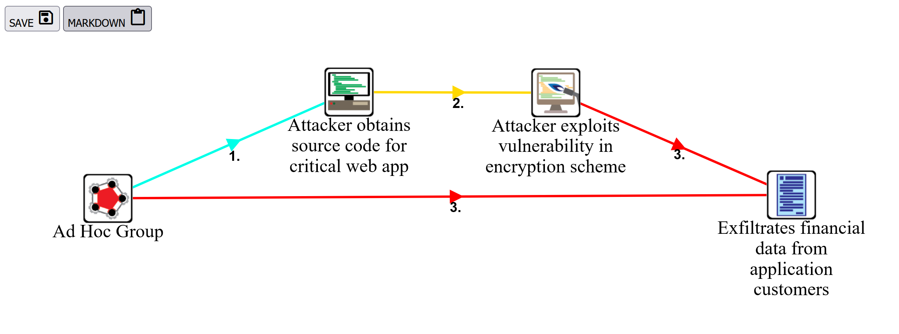
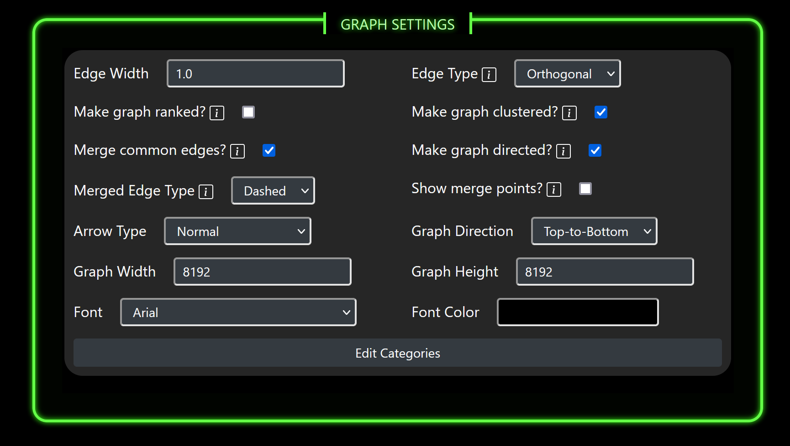

# BSides Augusta 2021

# Table of Contents

   * [Deploying ETM](#deploying-etm)
      * [Installing Dependencies](#installing-dependencies)
         * [Update](#update)
         * [Install Vim](#install-vim)
         * [Install GIT](#install-git)
         * [Install DOS2Unix](#install-dos2unix)
         * [Instal Docker Engine](#instal-docker-engine)
      * [Setting up your environment](#setting-up-your-environment)
         * [Creating directories](#creating-directories)
         * [Clone ETM](#clone-etm)
            * [Fatal error about certificate verification](#fatal-error-about-certificate-verification)
         * [Edit docker-compose.yaml](#edit-docker-composeyaml)
         * [Edit AppSettings.JSON](#edit-appsettingsjson)
         * [SSL Certificate](#ssl-certificate)
         * [Nginx Config](#nginx-config)
      * [Deploy](#deploy)
      * [BLS OPS NOTES](#bls-ops-notes)
   * [ETM Usage](#etm-usage)
      * [Creating Users](#creating-users)
      * [Editing Users](#editing-users)
      * [Deleting Users](#deleting-users)
      * [Creating an Assessment](#creating-an-assessment)
      * [Creating a Scenario](#creating-a-scenario)
      * [Creating Events](#creating-events)
      * [Editing an Event](#editing-an-event)
         * [NIST Description Helper](#nist-description-helper)
         * [MITRE ATT&amp;CK IDs](#mitre-attck-ids)
         * [Threat Sources](#threat-sources)
         * [Relevance to Findings](#relevance-to-findings)
         * [Automatic Risk Calculation](#automatic-risk-calculation)
            * [How is Risk Calculated](#how-is-risk-calculated)
         * [Finding Reference/Vulnerability Severity and Predisposing Condition/Pervasiveness of Predisposing Condition](#finding-referencevulnerability-severity-and-predisposing-conditionpervasiveness-of-predisposing-condition)
         * [Graph Elements](#graph-elements)
            * [Entity](#entity)
            * [Description](#description)
            * [Preceded By](#preceded-by)
      * [Creating a Template](#creating-a-Template)
      * [Editing a Template](#editing-a-Template)
      * [Exporting Graphs](#exporting-graphs)
      * [Exporting Threat Matrix Spreadsheet](#exporting-threat-matrix-spreadsheet)
      * [Exporting Threat Matrix PDF](#exporting-threat-matrix-pdf)
      * [Creating Threat Trees](#creating-threat-trees)

# Deploying ETM

This installation guide has been tested on fresh installs of Ubuntu 18.04 and 20.04.

## Installing Dependencies

ETM is written with .NET Core, and is designed to run on Linux systems.
ETM also is designed to work within Docker containers.

### Update

* `sudo apt update`
* `sudo apt upgrade`

### Install Vim

* `sudo apt install vim`

### Install GIT

* `sudo apt install git`

### Install DOS2Unix

* `sudo apt install dos2unix`

### Install Docker Engine

* `sudo apt update`
* `sudo apt install apt-transport-https ca-certificates curl gnupg-agent software-properties-common`
* `curl -fsSL https://download.docker.com/linux/ubuntu/gpg | sudo apt-key add -`
* `sudo add-apt-repository "deb [arch=amd64] https://download.docker.com/linux/ubuntu $(lsb_release -cs) stable"`
* `sudo apt update`
* `sudo apt install docker-ce docker-ce-cli containerd.io docker-compose`

## Setting up your environment

### Creating directories 

* /var/matrix
* /var/matrix/app
* /var/matrix/mongo
* /var/matrix/mongo/db
* /var/matrix/mongo/configdb

### Clone ETM

* `cd /var/matrix/app`
* `git clone https://github.com/blacklanternsecurity/enter_the_matrix.git`

### Edit docker-compose.yaml

* Change the following line to a unique password (alphanumeric)
* `- MONGO_INITDB_ROOT_PASSWORD=CHANGEMESUCKAH`

### Edit AppSettings.JSON

* `cd /var/matrix/app/enter_the_matrix`
* `vim appsettings.json`
* Alter the ConnectionString to use your password for the MongoDB container
* Replace the "Ldap" fields with your LDAP configuration
* Replace the "LocalAuthSettings" with your desired administrative account credentials

### SSL Certificate

* Place your SSL certificate at `/var/matrix/app/enter_the_matrix/matrix.cer`
* Place your SSL key at `/var/matrix/app/enter_the_matrix/matrix.key`
* To create your own self-signed certificate and key:
  + `sudo openssl req -x509 -nodes -days 365 -newkey rsa:2048 -keyout matrix.key -out matrix.cer`

### Nginx Config

* Alter `enter_the_matrix.conf` and replace `YOURDOMAIN` with your domain if you are using one

For whatever reason the nginx configuration does not play nicely coming from a Windows development environment even when specifically telling GIT to convert to LF end-of-line format. So, do the following:

* `dos2unix /var/matrix/app/enter_the_matrix/enter_the_matrix.conf`

## Build

### .NET SDK

If you are using Ubuntu 18.04:

* `wget https://packages.microsoft.com/config/ubuntu/18.04/packages-microsoft-prod.deb -O packages-microsoft-prod.deb`

Ubuntu 20.04:

* `wget https://packages.microsoft.com/config/ubuntu/20.04/packages-microsoft-prod.deb -O packages-microsoft-prod.deb`

* `sudo dpkg -i packages-microsoft-prod.deb`
* `sudo apt-get install -y apt-transport-https`
* `sudo apt-get update`
* `sudo apt-get install -y dotnet-sdk-5.0`

### Build the project

* `sudo cd /var/matrix/app/enter_the_matrix`
* `sudo dotnet publish --configuration Release`

## Deploy

* `cd /var/matrix/app/enter_the_matrix`
* `docker-compose up -d`

# ETM Usage

Access to all parts of the application requires authentication first.

## Creating Users

If you do not have LDAP authentication in place already, an administrative user can create user accounts within the application. From the login screen, select the "ADMIN" authentication option and sign in with the credentials set in the appsettings.json file during deployment.

Once you are authenticated as an administrator, you will be brought to the User Management page. Selecting "CREATE" will prompt you to input a new Username, Display Name, Given Name and Password.

Display Names are used in the application as part of the CSS styling. Given Names are used when creating Assessments/Scenarios/Events to tag activities to users.

You can also get to this page by clicking the "Admin" link at the top of every page after a person is authenticated. If the user is not in the "Admin" role, then they will be loggeed out and brought to the login screen again in order to authenticate as an "Admin" user.

## Editing Users

Selecting the "Edit" link next to each user will bring up a prompt to edit the Display Name, Given Name and Password for a user. The Username is not able to be changed.

## Deleting Users

Selecting the "Delete" link next to each user will bring up a confirmation prompt before proceeding to remove the user from the database.

## Creating an Assessment

Once you are logged in properly, navigate to "Assessments" and then click the "CREATE ASSESSMENT" button. Supply a title for the assessment you are creating and click "CREATE".

## Creating a Scenario

After creating an assessment you will be brought to the Scenario page. You can also get to the Scenario page later by selecting the appropriate Assessment.

To create a new Scenario, click "CREATE SCENARIO" and provide a title for the new Scenario.

From the Scenario page, you are also able to edit the title of the Assessment by clicking "EDIT ASSESSMENT" or delete the Assessment by clicking "DELETE ASSESSMENT".Clicking the "THREAT TREES" button will take allow you to create and edit the threat tree for your current assessment. Additionally, selecting "EXPORT" will prompt you to select how you want to export your threat matrix. You can chose either XLSX or PDF.

Scenarios are able to be re-ordered by clicking and dragging the Scenario element and releasing somewhere else in the list of Scenarios. This will determine the order that the Scenarios will be exported in the Threat Matrix Spreadsheet. Once the order is how you want it, click "SAVE CHANGES" to commit the ordering.

## Creating Events

To create an Event, select the Assessment and then Scenario you want to add the Event to. Once on the Events page, clicking "CREATE EVENT" will present you the option of either importing an Event from one of the Steplates already created, or create a new event.

Events on this page can be re-ordered if needed by clicking and dragging an Event item in the list and dropping it where you want it. This will determine the ordering of the Events in that particular Scenario in the exported Threat Matrix Spreadsheet. Once you are happy with the order they are in, click "SAVE CHANGES" to commit your ordering changes.

From this page you may edit the Scenario title by clicking "EDIT SCENARIO", delete the current Scenario by clicking "DELETE SCENARIO" or return to the Scenarios page by clicking "SCENARIOS". You can also generate a scenario graph by clicking "EXPORT GRAPH".

## Editing an Event

By selecting the "MAKE TEMPLATE" button, a new Template will be created using the current event and you will be taken to the Edit Template page to finalize any changes.

### NIST Description Helper

While filling in the individual factors for the event you are editing, you can take advantage of the helper info buttons on most of the factors. Clicking on these will display a modal overlay that contains the NIST descriptions for each severity level. BLS also includes our own interpretations of the NIST descriptions to help reduce any potential confusion.

### MITRE ATT&CK IDs

You are able to select an appropriate MITRE ATT&CK ID by selecting the category which expands displaying the various MITRE ATT&CK Tactics for that category. Selecting one of the tactics then displays the various Techniques under that Tactic.

Each Technique has a helper icon you can click on that will take you to that Technique's detailed information page on the MITRE website in a new tab.

These Techniques will be present in the exported Threat Matrix as IDs hyperlinked to the MITRE ATT&CK website for your clients to use in their remediation efforts.

If the intention is to create a Threat Tree for an assessment, it is necessary to select a MITRE ATT&CK ID for each event desired in the final Threat Tree. The unique ATT&CK IDs are collected to form the various nodes available to the user while creating a tree.

### Threat Sources

The threat sources presented in the list box are pulled from NIST guildlines on conducting a Risk Assessment.

### Relevance to Findings

Each Event should have some relevance to technical findings during your assessment.

### Automatic Risk Calculation

Based on your entries into this page, two factors are automatically calculated (Overall Likelihood and Risk) for you to avoid biasing outcomes.

#### How is Risk Calculated

NIST provides the information needed to properly calculate Risk. Three factors directly contribute to the final Risk value. These include Likelihood of Attack Initiation, Likelihood of Adverse Impact, and Level of Impact. The Likelihood factors are combined to form the Overall Likelihood value. Risk is then calculated based on combining the Overall Likelihood value and the Level of Impact value.

### Finding Reference/Vulnerability Severity and Predisposing Condition/Pervasiveness of Predisposing Condition

NIST provides guidance on quantifying a Serverity and Pervasiveness factor for a particular event. To make this more obvious and understandable, these have been broken out into separate fields. If a Finding Reference is not supplied, then the Vulnerability Severity slider will not be activated. Similarly, if a Predisposing Condition is not provided then the matching Pervasiveness of Predisposing Condition slider will be deactivated.

If only one of these are filled in, then the overall Severity and Pervasiveness factor in the exported Threat Matrix will be taken from the one enabled. If both are provided, then an average is taken of the two and floored.

### Graph Elements

To create a graph export of your Scenarios, you will need to provide information for each event.

#### Entity

Which Entity you choose here will determine the graph node image displayed in the exported graph.

#### Description

The Description you provide will become the label underneath the graph image in the exported graph.

#### Preceded By

This list contains each event already present in the current Scenario. If there are no events that precede this one, or you want this particular event to be tied directly to the root node (The attacker node) then you can select None (Root Node). Otherwise, selecting on of the other events in the list will make that event the parent to the one you are editing currently.

It is also possible to have multiple preceded by values. This gives the user the ability to make more complex graphs showing multiple events leading to a single consequence, or singular events leading to multiple simultaneuos consequences.

## Creating a Template

To create a Template, navigate to the Templates page. Once there, you can click "CREATE TEMPLATE". This will create a new blank Template and bring you to the Template editing page.

On this page, there is also an "IMPORT" button which will prompt you to select a proper template pack JSON file. Uploading the file will generate templates from the contents. To view the proper structure of the JSON file, it is recommended to first create a few Templates using the GUI and then export them using the "EXPORT" button.

The "DELETE ALL" button will prompt you to confirm you want to remove all templates from the database. Once confirmed they are removed.

## Editing a Template

Editing a Template is an identical process to editing an Event, however certain considerations should likely be made to make these as reusable as possible. This should allow you to maintain more consistency in quantifying event factors.

## Exporting Graphs

To export a threat graph for a specific Scenario, select the Assessment that the Scenario belongs to. From the Scenarios page, select the Scenario you want to export as a graph. From the Events page, click the "EXPORT GRAPH" button. This generates a graph using GraphViz in the background, and displays the resulting graph in the browser. The graph will have a transparent background once saved so it may be used in other reporting materials as supportive information. Also included is a simple markdown table that is populated with the event descriptions the user provided. These descriptions give the graph edge's more context. The table is written in markdown for easy inclusion with reports generated using [WriteHat](https://github.com/blacklanternsecurity/writehat).

To return to the application just use your browser's back button or click the "BACK" button.

## Exporting Threat Matrix Spreadsheet

To export your Assessment to a Threat Matrix Spreadsheet, select the Assessment you want to export. Then, from the Scenarios page, click "EXPORT" followed by "XLSX". The default title for the exported spreadsheet will be AssessmentTitle_ThreatMatrix_YYYY_MM_DD. Exported XSLX documents are "living". This means that as the document is updated following remediation/mitigation efforts, the values for Overall Likelihood and Risk will be automatically adjusted to reflect those efforts.

## Exporting Threat Matrix PDF

To export your Assessment to a printable PDF, select the Assessment you want to export. Then, from the Scenarios page, click "EXPORT" followed by "HTML". This will present with a threat matrix formated to fit within tables that can be printed as a PDF. It is paginated to avoid page breaks within events, and is designed to be printed in landscape mode. To get the full effect of the page styling in the printed version, in your print settings, please disable headers and footers. Also, enable background graphics.

## Creating Threat Trees

When creating a threat tree for the first time under an assessment, the user is presented with the ability to create categories that will be used within the threat tree. These can be entirely custom so that the tree can convey whatever sort of information is necessary. Each category is assigned a color by the user that will be used to colorize that category's nodes.

Once the categories are entered and the tree is generated, the user is brought to the edit page. Here, the user has the options to save the current changes, delete the tree and start over, or go back to the scenarios screen. Clicking the "EXPORT" button will generate the threat tree graph along with a legend that can be used in other reporting utilities.

Each graph has a collection of settings that will determine how the resulting tree looks. Each settings has an info helper button to aid the end user in making selections. These info helpers will have either textual or graphical examples to ensure operator understanding.

The nodes in a threat tree are the set of MITRE ATT&CK IDs used across the entire assessment. Each node within a threat tree comes with its own collection of settings. Where these settings are not immmediately obvious, a info helper button has been included to provide more insight.

The section titled "How did this technique present itself?" is where the user would place the specific actions taken during the assessment that were categorized by the corresponding ATT&CK ID.

The section titled "Which techniques lead to TXXXX?" is where the edges are connected between nodes. It is possible to link multiple nodes to each other showing multiple paths of compromise.

Once the user finishes applying the desired settings, an exported threat tree might look similar to the above example.

# References

* https://github.com/blacklanternsecurity/writehat
* https://csrc.nist.gov/News/2012/NIST-Special-Publication-800-30-Revision-1
* https://attack.mitre.org/
* https://collaborate.mitre.org/attackics/index.php/Main_Page
